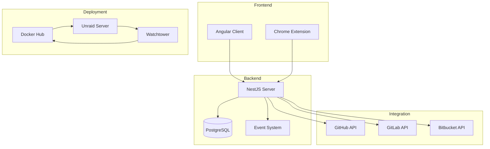

# Project Summary: achievibit-v3
*Version: 1.0*
*Created: 2024-04-05*
*Last Updated: 2024-04-05*

## Project Overview
achievibit is a gamification system for Git platforms that adds achievements to pull requests. It enhances the code review process by making it more engaging and fun through game-like elements.

## Key Components

### 1. Core Features
- Pull request achievement tracking
- Multi-platform Git integration (GitHub, GitLab, Bitbucket)
- Real-time achievement notifications
- User profiles and progress tracking
- Chrome extension for GitHub integration

### 2. Technical Foundation
- Modern microservices architecture
- Event-driven achievement system
- Real-time WebSocket updates
- Secure OAuth integration
- Automated deployment pipeline

### 3. Development Environment
- VS Code devcontainer setup
- Docker-based development
- PNPM workspace management
- Comprehensive testing suite
- Automated CI/CD pipeline

## Project Structure

## Development Workflow

### 1. Local Development
- Development container environment
- Hot-reload capabilities
- Local database instance
- Webhook testing support

### 2. Testing Strategy
- Unit tests (Jest)
- Integration tests
- E2E tests (Playwright)
- Achievement testing

### 3. Deployment Process
- GitHub Actions pipeline
- Docker image builds
- Docker Hub publishing
- Unraid automated updates

## Security Considerations

### 1. Authentication
- OAuth2 integration
- JWT token management
- Secure session handling
- Role-based access control

### 2. Data Protection
- Environment isolation
- Secret management
- Rate limiting
- Input validation

### 3. Infrastructure
- SSL/TLS encryption
- Network segmentation
- Regular backups
- Monitoring and alerts

## Project Status

### 1. Completed Setup
- Project requirements defined
- Technology stack selected
- Architecture designed
- Development environment configured
- Deployment pipeline established

### 2. Next Steps
- Begin development phase
- Implement core features
- Set up monitoring
- Deploy beta version

### 3. Future Enhancements
- Additional achievement types
- More platform integrations
- Enhanced analytics
- Mobile application

## Documentation Index

### 1. Project Documentation
- [Project Brief](projectbrief.md): Core requirements and goals
- [System Patterns](systemPatterns.md): Architecture and design decisions
- [Tech Context](techContext.md): Technology stack and environment
- [Active Context](activeContext.md): Current status and next steps
- [Progress](progress.md): Project progress tracking

### 2. External Resources
- [GitHub Repository](https://github.com/Kibibit/achievibit)
- [API Documentation](https://achievibit.kibibit.io/docs/)
- [Chrome Extension](https://chrome.google.com/webstore/detail/achievibit/iddkmddomdohnihbehiamfnmpomlhpee)

## Maintenance Guidelines

### 1. Code Management
- Follow conventional commits
- Maintain test coverage
- Update documentation
- Regular dependency updates

### 2. Deployment
- Version control strategy
- Database migrations
- Backup procedures
- Rollback plans

### 3. Monitoring
- Performance metrics
- Error tracking
- User analytics
- Resource utilization

## Support and Contact

### Project Team
- Lead Developer: Neil Kalman (@thatkookooguy)
- Core Contributors:
  - O T (@ortichon)
  - Michael Dunaevsky (@dunaevsky)
  - Andrea Rosales (@andrearosr)
  - Daniel Ruf (@DanielRuf)

### Community
- GitHub Issues: Bug reports and feature requests
- Discussions: Community engagement
- Contributing Guidelines: How to contribute

---

*This document provides a comprehensive overview of the achievibit-v3 project and serves as an index for all project documentation.* 