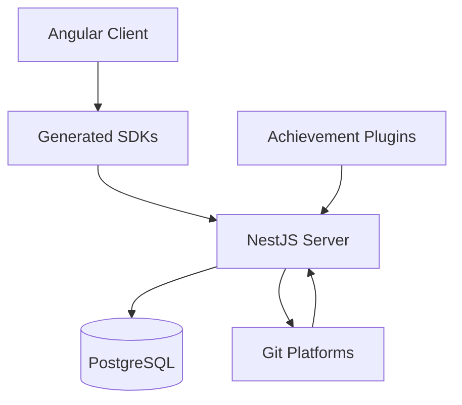

# System Architecture & Technical Decisions: achievibit-v3
*Version: 1.0*
*Created: 2024-04-05*
*Last Updated: 2024-04-05*

## Architecture Overview
achievibit follows a modern microservices-based architecture with a clear separation of concerns. The system is structured as a monorepo with distinct services and modules:



## Core Components

### 1. Client Application (Angular)
- **Purpose**: User interface for achievement tracking and management
- **Structure**:
  - Pages: Main application routes and views
  - Services: Business logic and API communication
  - Shared: Reusable components and utilities
  - Interceptors: HTTP request/response handling

### 2. Server Application (NestJS)
- **Purpose**: Core backend service handling webhooks and achievement logic
- **Key Modules**:
  - Auth: Authentication and authorization
  - Webhooks: Git platform webhook handling
  - Events: Real-time event management
  - Users: User management and profiles
  - Organizations: Organization management
  - Pull Requests: PR tracking and analysis
  - Achievements: Achievement processing engine
  - Shields: Badge generation and serving

### 3. Achievement System
- **Purpose**: Pluggable achievement definitions and processors
- **Structure**:
  - Abstract Achievement Base Class
  - Individual Achievement Implementations
  - Achievement Tests and Snapshots
  - Development Tools

### 4. SDK Layer
- **Purpose**: Type-safe API clients for different platforms
- **Variants**:
  - TypeScript/Node.js SDK
  - Angular SDK
  - Auto-generated from OpenAPI specs

## Design Patterns

### 1. Architectural Patterns
- **Microservices Architecture**: Separate services for different concerns
- **Event-Driven Architecture**: Real-time updates via WebSocket
- **Plugin Architecture**: Modular achievement system
- **API Gateway Pattern**: Central server handling multiple Git platforms

### 2. Design Patterns
- **Dependency Injection**: Used throughout NestJS application
- **Observer Pattern**: WebSocket event handling
- **Factory Pattern**: Achievement creation and processing
- **Strategy Pattern**: Different Git platform integrations
- **Decorator Pattern**: NestJS decorators for routes and metadata
- **Repository Pattern**: Database access abstraction

### 3. Integration Patterns
- **Webhook Pattern**: Git platform integration
- **OAuth Flow**: Authentication with Git platforms
- **Event Sourcing**: Achievement tracking
- **Circuit Breaker**: API call protection

## Technical Decisions

### 1. Monorepo Structure
- PNPM Workspaces for package management
- Shared configurations and tooling
- Independent versioning for packages
- Centralized build and test scripts

### 2. Real-time Updates
- Socket.io for WebSocket communication
- Event-based architecture for achievements
- Real-time achievement notifications

### 3. Database Design
- TypeORM for database abstraction
- PostgreSQL for reliable data storage
- Migration system for schema changes
- Entity relationship modeling

### 4. Testing Strategy
- Jest for unit testing
- Playwright for E2E testing
- Snapshot testing for achievements
- API testing with SuperTest

## System Components

### Frontend Components
- **UI Layer**:
  - Achievement Display
  - User Profile
  - Organization Dashboard
  - Real-time Notifications
- **State Management**:
  - RxJS Observables
  - Service Layer
  - HTTP Interceptors

### Backend Components
- **Core Services**:
  - Authentication Service
  - Webhook Service
  - Achievement Service
  - User Service
- **Infrastructure**:
  - Database Layer
  - Caching Layer
  - Event Bus
  - Task Scheduler

### Achievement Components
- **Achievement Engine**:
  - Achievement Registry
  - Event Processors
  - Rule Engine
  - Badge Generator

## Integration Points

### External Systems
- GitHub API Integration
- GitLab API Integration
- Bitbucket API Integration

### Internal Systems
- **API Layer**:
  - REST Endpoints
  - WebSocket Events
  - GraphQL (planned)
- **Storage Layer**:
  - Database
  - File Storage
  - Cache

## Security Considerations

### Authentication & Authorization
- JWT-based authentication
- OAuth2 integration
- Role-based access control
- Session management

### Data Protection
- Webhook secret validation
- API rate limiting
- CORS configuration
- Data encryption

### Monitoring & Logging
- Winston logging
- Prometheus metrics
- Health checks
- Error tracking

## Project Scaffolding

### Directory Structure
```
achievibit-v3/
├── .cursor/               # Cursor IDE configuration
├── .devcontainer/        # Development container setup
├── .github/              # GitHub Actions and configs
├── achievements/         # Achievement plugins
│   ├── src/             # Achievement implementations
│   └── lib/             # Shared achievement utilities
├── client/              # Angular frontend
│   ├── src/             # Application source
│   │   ├── app/         # Core application
│   │   ├── pages/       # Route components
│   │   └── shared/      # Shared components
│   └── dist/            # Build output
├── server/              # NestJS backend
│   ├── src/             # Application source
│   │   ├── auth/        # Authentication
│   │   ├── webhooks/    # Git webhooks
│   │   └── events/      # Real-time events
│   └── dist/            # Build output
├── sdk/                 # Generated API clients
│   ├── angular/         # Angular SDK
│   └── node/            # Node.js SDK
├── e2e/                 # End-to-end tests
├── scripts/             # Build and utility scripts
└── plugins/             # Custom development plugins
```

### Development Environment
1. **Container Setup**
   - VS Code devcontainer
   - Docker Compose services
   - PostgreSQL database
   - Development tools and extensions

2. **Port Mapping**
   - 10101: Client + Proxy
   - 10102: Backend
   - 10103: Playwright UI
   - 8000: NestJS DevTools

3. **Environment Configuration**
   - Development: `.env.devcontainer.achievibit.json`
   - Production: Environment variables
   - Docker: Container-specific settings

### Build Configuration
1. **Workspace Setup**
   - PNPM workspace configuration
   - Shared dependencies management
   - Package linking strategy

2. **Build Scripts**
   ```json
   {
     "start:dev": "pnpm -r --parallel run start:dev",
     "build:prod": "pnpm -r --parallel run build:prod",
     "build": "pnpm -r --parallel run build"
   }
   ```

3. **SDK Generation**
   ```json
   {
     "sdk:node": "swagger-codegen generate -i http://localhost:10102/api/docs-json -l typescript-axios",
     "sdk:angular": "swagger-codegen generate -i http://localhost:10102/api/docs-json -l typescript-angular"
   }
   ```

### Development Tools
1. **Code Quality**
   - ESLint configuration
   - StyleLint setup
   - TypeScript configuration
   - Editor settings

2. **Testing Infrastructure**
   - Jest configuration
   - Playwright setup
   - Test utilities and helpers

3. **Git Hooks**
   - Husky configuration
   - Commit message validation
   - Pre-commit linting

### Security Setup
1. **Authentication**
   - OAuth app configuration
   - JWT secret management
   - Session handling

2. **API Security**
   - CORS configuration
   - Rate limiting setup
   - Webhook secrets

3. **Development Secrets**
   - Local secret management
   - Environment variable handling
   - Secure configuration storage

### Continuous Integration
1. **GitHub Actions**
   - Unit test workflow
   - E2E test workflow
   - Build and deploy pipeline

2. **Quality Gates**
   - Code coverage requirements
   - Linting checks
   - Type checking

3. **Deployment Strategy**
   - Environment promotion
   - Version management
   - Release automation

---

*This document captures the system architecture and design patterns used in the project.* 