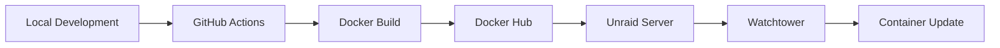

# Technology Context: achievibit-v3
*Version: 1.0*
*Created: 2024-04-05*
*Last Updated: 2024-04-05*

## Development Environment
- OS: macOS 24.4.0
- Shell: /opt/homebrew/bin/zsh
- IDE: Cursor (VS Code-based)
- Node.js: v20
- Package Manager: PNPM
- Container Runtime: Docker
- Database: PostgreSQL

## Technology Stack
### Frontend (Client)
- Framework: Angular 17.3
- UI Components:
  - BeerCSS v3.7
  - Material Dynamic Colors
  - Custom Design System
- State Management: RxJS 7.8
- HTTP Client: Axios
- WebSocket: Socket.io Client
- Build Tools: Angular CLI
- Testing: Jasmine & Karma

### Backend (Server)
- Framework: NestJS 10
- Runtime: Node.js 20
- Database: PostgreSQL with TypeORM
- Authentication:
  - Passport.js
  - JWT
  - OAuth2 (GitHub, GitLab, Bitbucket)
- API Documentation: Swagger/OpenAPI
- WebSocket: Socket.io
- Task Scheduling: @nestjs/schedule
- Monitoring: Prometheus
- Logging: Winston
- Testing: Jest

### SDKs & Integration
- GitHub SDK: @octokit/rest
- GitLab SDK: @gitbeaker/rest
- Bitbucket SDK: bitbucket
- Custom Generated SDKs:
  - TypeScript/Node.js
  - Angular

## Development Tools
- Version Control: Git
- Code Quality:
  - ESLint
  - StyleLint
  - TypeScript
  - Prettier
- Testing:
  - Jest (Backend)
  - Jasmine (Frontend)
  - Playwright (E2E)
- CI/CD: GitHub Actions
- API Development:
  - Swagger/OpenAPI
  - AsyncAPI (WebSocket)
- Development Container: VS Code Devcontainer

## Build & Deployment
- Build System: 
  - Angular CLI (Frontend)
  - NestJS CLI (Backend)
  - PNPM Workspaces (Monorepo)
- Containerization:
  - Docker
  - Docker Compose
- Environment Management:
  - dotenv
  - @kibibit/configit

## Testing Framework
- Unit Testing:
  - Jest (Backend)
  - Jasmine (Frontend)
- E2E Testing: Playwright
- API Testing: SuperTest
- Coverage: Jest Coverage
- Test Runners:
  - Jest
  - Karma (Frontend)

## Dependencies
### Core Dependencies
- TypeScript 5.6
- RxJS 7.8
- Axios
- Socket.io
- TypeORM
- Winston Logger
- Passport.js & JWT

### Development Dependencies
- ESLint 8
- StyleLint
- TypeScript Compiler
- Various Type Definitions (@types/*)
- Development Utilities:
  - ts-node
  - ts-jest
  - nodemon

## Version Control
- System: Git
- Hosting: GitHub
- Branch Strategy: Feature Branching
- Commit Convention: Conventional Commits
- Hooks: Husky
- Automation: GitHub Actions

## Security
- Authentication: JWT & OAuth2
- Rate Limiting: @nestjs/throttler
- CORS Configuration
- Webhook Secrets
- Environment Isolation
- Secure Session Management

## Environment Setup

### Local Development
1. **Development Container**
   - VS Code devcontainer
   - Node.js 20 runtime
   - PNPM package manager
   - PostgreSQL database
   - Development tools and extensions

2. **Environment Configuration**
   ```json
   {
     "BASE_BACKEND_URL": "http://localhost:10102",
     "PORT": 10102,
     "JWT_SECRET": "development-mode",
     "GITHUB_WEBHOOK_SECRET": "development-mode",
     "GITLAB_WEBHOOK_SECRET": "development-mode",
     "BITBUCKET_WEBHOOK_SECRET": "development-mode",
     "SYNCHRONIZE_DATABASE": true,
     "SMEE_WEBHOOK_PROXY_CHANNEL": "<unique-channel-name>"
   }
   ```

3. **Port Configuration**
   - 10101: Client Application
   - 10102: Backend API
   - 10103: Playwright UI
   - 8000: NestJS DevTools
   - 5432: PostgreSQL

### Deployment Pipeline



1. **Docker Image Build**
   - Multi-stage build process
   - Production dependencies only
   - Environment-specific configurations
   - Security hardening

2. **Docker Hub Integration**
   ```yaml
   image: thatkookooguy/achievibit
   tags:
     - latest
     - beta
     - v3.x.x
   ```

3. **Unraid Deployment**
   - Watchtower container monitoring
   - Automatic image updates
   - Volume persistence
   - Network configuration

### Environment Stages

1. **Development**
   ```yaml
   services:
     app:
       build: .
       ports:
         - '10101:10101'  # Client
         - '10102:10102'  # Server
       volumes:
         - .:/workspace
       environment:
         NODE_ENV: development
   ```

2. **Staging/Beta**
   ```yaml
   services:
     app:
       image: thatkookooguy/achievibit:beta
       ports:
         - '80:10102'
       environment:
         NODE_ENV: staging
   ```

3. **Production**
   ```yaml
   services:
     app:
       image: thatkookooguy/achievibit:latest
       ports:
         - '80:10102'
       environment:
         NODE_ENV: production
   ```

### Unraid Configuration

1. **Container Setup**
   ```yaml
   name: achievibit
   image: thatkookooguy/achievibit:latest
   ports:
     - '80:10102'
   volumes:
     - /path/to/data:/app/data
     - /path/to/config:/app/config
   ```

2. **Watchtower Integration**
   ```yaml
   name: watchtower
   image: containrrr/watchtower
   volumes:
     - /var/run/docker.sock:/var/run/docker.sock
   command: --interval 30 --cleanup achievibit
   ```

3. **Persistence Configuration**
   - Database volumes
   - Configuration files
   - Logs and metrics
   - Achievement data

### Security Measures

1. **Production Secrets**
   - Environment variables
   - Docker secrets
   - Secure key storage
   - OAuth credentials

2. **Network Security**
   - Reverse proxy configuration
   - SSL/TLS termination
   - Internal network isolation
   - Rate limiting

3. **Monitoring & Logging**
   - Container health checks
   - Log aggregation
   - Metrics collection
   - Alert configuration

### Backup Strategy

1. **Data Backup**
   - Database dumps
   - Configuration backups
   - Achievement data
   - User content

2. **Backup Schedule**
   - Daily incremental
   - Weekly full backup
   - Monthly archives
   - Retention policy

3. **Recovery Procedures**
   - Container recreation
   - Data restoration
   - Configuration recovery
   - Service verification

### Maintenance Procedures

1. **Updates**
   - Image version control
   - Dependency updates
   - Security patches
   - Database migrations

2. **Monitoring**
   - Resource utilization
   - Error rates
   - Response times
   - User activity

3. **Scaling**
   - Load balancing
   - Database scaling
   - Cache management
   - Resource allocation

---

*This document describes the technologies used in the project and how they're configured.* 